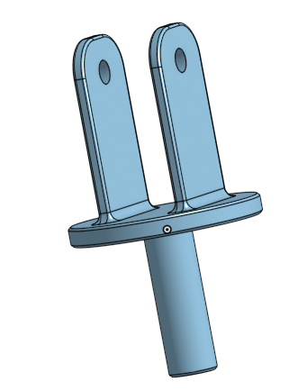
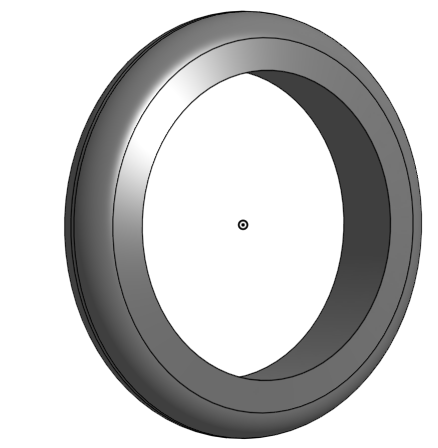
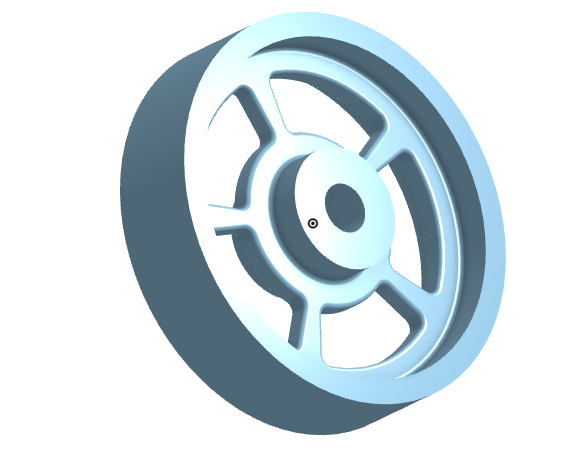
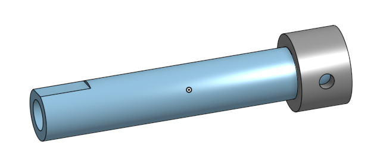
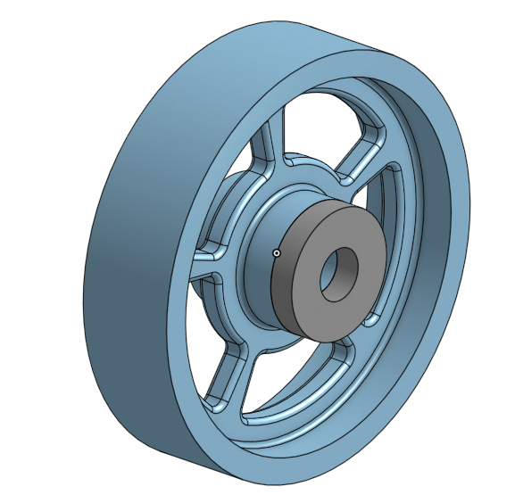
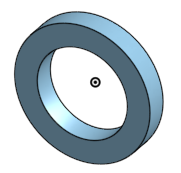
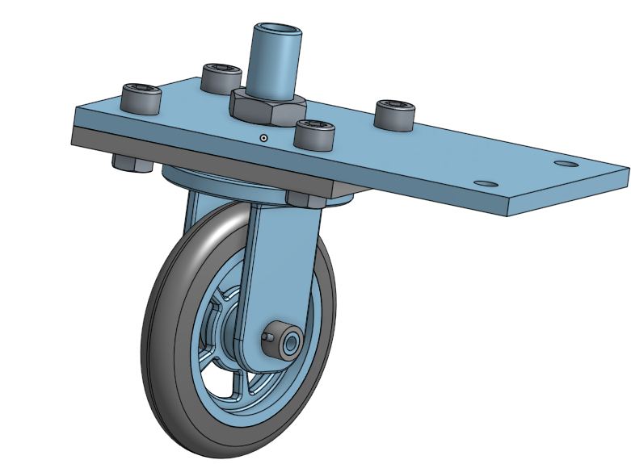
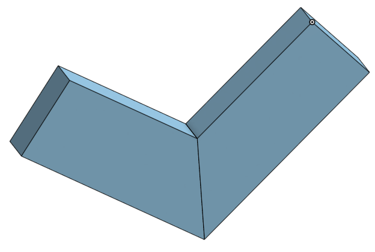
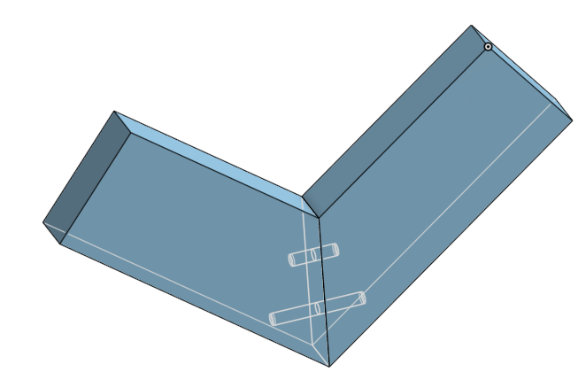

# Basic CAD

Making the Caster in OnShape

---

## Table of Contents
* [Table of Contents](#Table-of-Contents)
* [Base](#Base)
* [Mount](#Mount)
* [Fork](#Fork)
* [Tire](#Tire)
* [Wheel](#Wheel)
* [Axle/Collar/Bearings](#Axle-Collar-Bearings)
* [Caster Assembly](#Caster-Assembly)
* [Dorothy's Dowel Pins and Picture Frame](#Dorothys-Dowel-Pins-and-Picture-Frame)
* [Universal Joint](#Universal-Joint)

## Base

### Description

I created the Mount. All I had to do was make a rectangle(200x120mm), make an extrusion(8mm), and used a linear pattern to duplicate a circle(10mm diameter, 6 circles - 80mm apart).

### Image

### Link

[Click This link to view Caster Base + Mount](https://cvilleschools.onshape.com/documents/30f599c68d1a623d378a571f/w/de6902057127ae29103d8afc/e/022da94a1ce20d239f99b214)

### Reflection

I used the linear pattern feature for the first time. It was very simple. I also was learning how to use the "Use" feature for the next part. I made a mistake because I was using a part pattern instead of a feature pattern while using the linear pattern. I discussed with my teacher and got that fixed.

---

## Mount

### Description

I created the Mount. It was the same as the base, but I didn't have do do much because I transfered all the dimensions from the Base using the "Use" tool.
### Image

### Link

[Click This link to view Caster Base + Mount](https://cvilleschools.onshape.com/documents/30f599c68d1a623d378a571f/w/de6902057127ae29103d8afc/e/022da94a1ce20d239f99b214)

### Reflection

I got to test out and use the "Use" tool for the first time. I messed up because I accidentally used the entire sketch instead of just the holes. The hole thing got duplicated but I changed that after.

---

## Fork

### Description

The Fork was very simple to create. I made a circle(80mm, extruded 8mm). On that circle I made a rectangle(40x15mm) and mirrored it over to the other side. Then, on the bottom of the big circle, 2 circles(15 and 20mm diameters,) and I extruded the space between them(60mm). I added some fillets around all the edges for it to look better.

### Image

### Link

[Click This link to view Fork](https://cvilleschools.onshape.com/documents/30f599c68d1a623d378a571f/w/de6902057127ae29103d8afc/e/2ca0eab6df75f58b86dc4f2d)

### Reflection

I started using the fillet tool. I had to use Google to see the fillet feature and the chamfer feature to know the difference, but I didn't make any errors.

---

## Tire

### Description

The Tire was the simplest part to create so far. I made a trapezoid(20mm base and 10 degree angles at the bottom). I dimensioned it below the origin(80mm diameter from the base, and 110mm diameter from the top of the trap.). This is so that it would know how big the tire would be. I then revolved it and changes the colr to gray to make it look more like a tire.

### Image

### Link

[Click This link to view Tire](https://cvilleschools.onshape.com/documents/30f599c68d1a623d378a571f/w/de6902057127ae29103d8afc/e/ed003e8ebd534ca374608d4f)

### Reflection

I changed the apperence for the first time. I had to use the OnShape forum to find where to change the color by using [This Link](https://forum.onshape.com/discussion/5/id-like-to-be-able-to-change-the-color-of-parts-in-my-model).

---

## Wheel

### Description

The Wheel was probably the most complicated part to make out of all the others, but it was also not too hard. I had to make some extrusions and some sketchs to make a really nice rim for the tire I made in the previous assignment.

### Image

### Link

[Click This link to view Wheel](https://cvilleschools.onshape.com/documents/30f599c68d1a623d378a571f/w/de6902057127ae29103d8afc/e/7533e7b0779816ec0754e851)

### Reflection

I did have some initial difficulty in creating the first sketch because I accidentally skipped a step, but I solved that problem quickly. After revolving the sketch, I had to sketch/extrude again to create the spoke and I used a pattern to duplicated that. Next time while making a bit complex part, I have to make sure to follow the steps carefully.

---

## Axle-Collar-Bearings

### Description

There were a couple steps to making this part. I had to make a couple extrusions, and I had to make a few extra sketches.

The Axle is a hollow pipe(60mm long, 10mm outer circle,6mm inner circle). There is a cut(10mm) 4.5mm above the origin on the face of Axle extrude.

The collar is a cylinder (10mm long, outer diameter of 15mm, inner diameter of 10mm with a 3mm hole).

The bearing is a cylinder(5mm long with an inner diameter of 10mm,outer diameter of 25mm).

The big bearing is ANOTHER cylinder(5mm long with an inner diameter of 20mm,outer diameter of 30mm)
After I finished the Axel & Collar, I also added a small bearing to my Wheel, and I made a new Part - Big Bearing. (See 3 pictures respectively)

### Image 

  

### Link

- [Click This link to view Axle & Collar](https://cvilleschools.onshape.com/documents/30f599c68d1a623d378a571f/w/de6902057127ae29103d8afc/e/4bafecd75b9ce972ced17838)

- [Click This link to view Wheel Bearing](https://cvilleschools.onshape.com/documents/30f599c68d1a623d378a571f/w/de6902057127ae29103d8afc/e/7533e7b0779816ec0754e851)

- [Click This link to view Big Bearing](https://cvilleschools.onshape.com/documents/30f599c68d1a623d378a571f/w/de6902057127ae29103d8afc/e/75e5ef3c5b2f61d17ed3cd15)

### Reflection

While creating the Axle & Collar, I had to use some new features. To create the screw hole I had to center the hole sketch by using the Midpoint constraint. I did have a bit of difficulty while extruding the hole because I was pressing the wrong sketch. I was able to practice using the "Use" tool again, and I feel confident in "Using" that feature:) The big bearing was too easy. Just 2 circles and an extrusion.

---

## Caster Assembly

### Description

In this assignment I put together all the parts I previously made. I had to use mates to put together all my parts. It was very easy. After I put together all the parts, I had to add in some screws and bolts in the holes I made and then I was done. **Caster Completed**

### Image

### Link

[Click This link to view Caster Assembly](https://cvilleschools.onshape.com/documents/30f599c68d1a623d378a571f/w/de6902057127ae29103d8afc/e/9a5ce7a0eb51a89c98335ecb)

### Reflection

The assembly was fairly simple. I was watching the video that Dr.Shields made t know where each part goes. I had a little bit of trouble in inserting the screws, but I re-watched the video a couple times and I got it done. I had to work a bit differently than in the video while adding the pin to hold the axle, but after a few trial and error runs, I gt it. Instead of selecting the face of the axle flat part, I just selected the edge and then I made an offset for it to not poke out.

---

## Extra Credit CAD Assignents

---

## Dorothys Dowel Pins and Picture Frame

### Description

For this extra assignment I was creating Dowel Pins and a Picture Frame. Thanks to the videos, it was super simple to create. In this assignment we learned how to use configurations. We were suposed to make 16 different versions of pins, with different Lengths, Diameters, and Chamfers. Instead of making the same part so many times, we used a neat tool called Configurations. We were able to create List Configurations, and we could easily switch between our 16 different configurations. We then inserted them into an assembly alog with a picture frame. I quickly made a picture frame. It took like 2 minutes. I just sketched a trapezoid, put some random dimensions(it doesn't matter how big it is) and made 2 holes. It was simple.

### Image

 

### Link

[Click This link to view Dorothy's Dowel Pins and Picture Frame](https://cvilleschools.onshape.com/documents/e64693401510975bda48502b/w/dc3295012e3151b5bfb93ef0/e/ba47b2177ec5bee7659f62d2?configuration=List_60R5DNol69tVLO%3D_1_4_inch%3BList_H7m4huA7qYebvR%3DDefault%3BList_HHZmv2Sj6cMz1f%3D_2_Inch)

### Reflection

The videos made the assignment very easy, and I think that I am doig well. At the beginning of the CAD assignments, I was pretty good with Onshape as I had used it a bit before, but now I am 110% confident in using it.The frame tested my Onshape skills, and I was able to make it easily on my own. I messed up the configurations a bit in the beginning, because I had no idea how to use it, but after re-watching the videos I got it done. The assembly also got messed up a few times because I clicked on a few incorrect mate connectors, so I slowed down and tried to click them more carefully.

---

## Universal Joint

### Description

**Cube Thingy** - A 20x20x20mm cube, with 8mm diameter cylinders, 10mm long. I used a linear pattern to put it on 4 faces of the cube.

**Shaft** - I used a cylinder 30mm, and then extruded it 50mm. I cut out a rectangle to make it like the fork in the Caster CAD assignment(30x20mm). Then 2 rectangles from the sides to make it thinner(30x5mm). I used Fillets on the edges and a centered hole on each side(8mm diameter, and 10mm from the top)

**Bracket** I created the Universal Joint. To make it, make a couple lines in a sketch - 50, 110, 30, 50mm. Make these lines to form the shape of the Bracket(blue).The I made a surface extrude and then used to the thicken feature for 5 mm. 

I then used cylindrical mates to fix the shafts to the brackets, and revolute mates to fix the cube into the holes on the shaft.

### Image(GIF)

### Link

[Click This link to view Universal Joint](https://cvilleschools.onshape.com/documents/ec7dd98bbc2fd338348246ba/w/4f3f86c3afe79ff1caf7f377/e/a1e8db3716d5a0196408b2fe)

