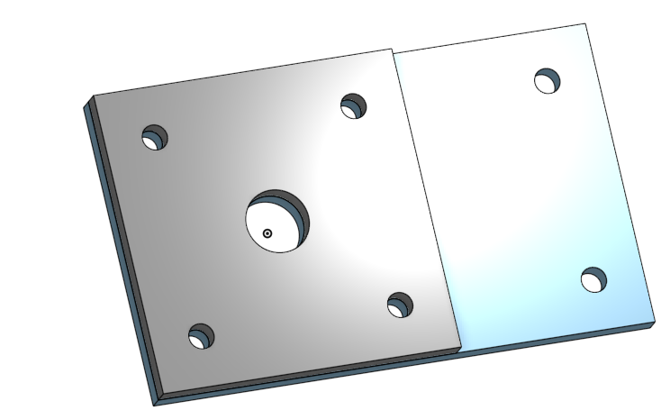

# Caster-CAD-Assingment
## Building the Caster in OnShape

1. **I created the Caster Base and Mount in Onshape**

[Click This link to view Caster Base + Mount](https://cvilleschools.onshape.com/documents/30f599c68d1a623d378a571f/w/de6902057127ae29103d8afc/e/022da94a1ce20d239f99b214)

2. **I created the Mount with the Base**

[Click This link to view Caster Base + Mount](https://cvilleschools.onshape.com/documents/30f599c68d1a623d378a571f/w/de6902057127ae29103d8afc/e/022da94a1ce20d239f99b214)

3. **I created the Fork**

[Click This link to view Fork](https://cvilleschools.onshape.com/documents/30f599c68d1a623d378a571f/w/de6902057127ae29103d8afc/e/2ca0eab6df75f58b86dc4f2d)

4. **I created the Tire**

[Click This link to view Tire](https://cvilleschools.onshape.com/documents/30f599c68d1a623d378a571f/w/de6902057127ae29103d8afc/e/ed003e8ebd534ca374608d4f)

5. **I created the Wheel**

[Click This link to view Wheel](https://cvilleschools.onshape.com/documents/30f599c68d1a623d378a571f/w/de6902057127ae29103d8afc/e/7533e7b0779816ec0754e851)
